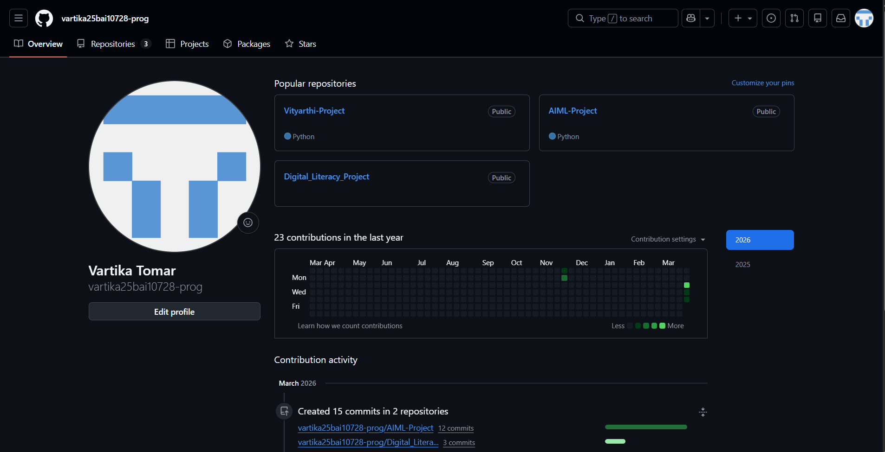
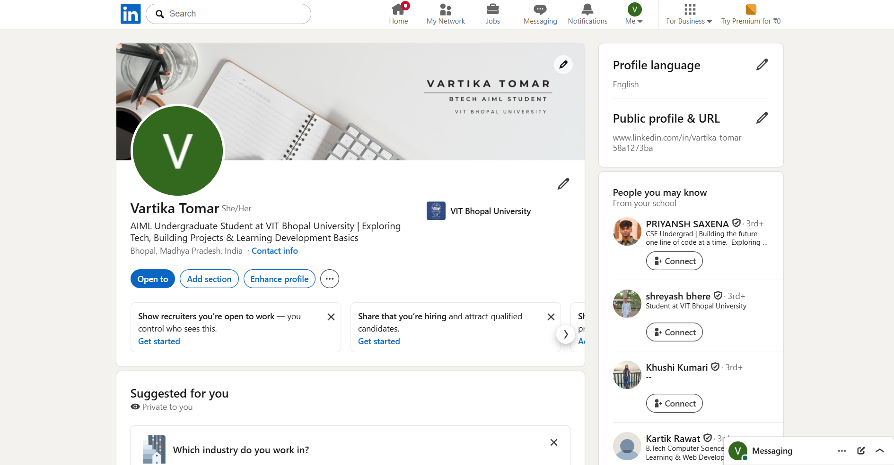
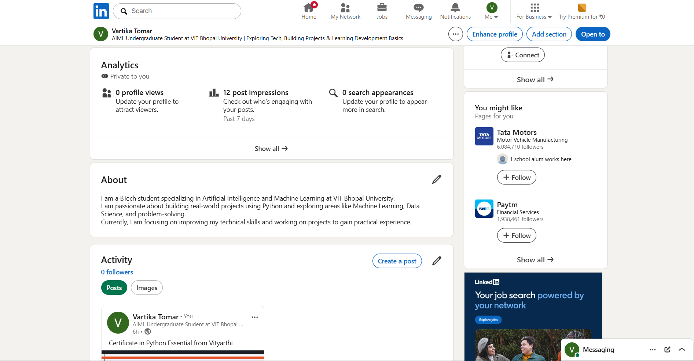

##  Task 2

# Screenshot 1

# Screenshot 2

# Screenshot 3

# Screenshot 4

## Reflection Notes

Creating my LinkedIn and GitHub profiles helped me understand how important it is to have a professional presence online. Before this task, I didn’t have much of a knowledge about LinkedIn and Github, but through the process  of making this project I've learned so much and now I see how it can represent my skills and interests.

Making my Kaggle Account helped me in Problem Understanding like to analyze the dataset and build a machine learning model, I started with data cleaning, including handling missing values and encoding categorical variables.

While making my LinkedIn profile, I learned how to present my information clearly, like adding a banner to my profile, a short bio, and my skills. On GitHub, I understood how developers share their work and projects, which is useful for learning and collaboration.

One challenge I faced was learning how to do things correctly. It took some time to organize everything properly. Overall, this task helped me improve my digital literacy and made me more aware of managing my online identity.
